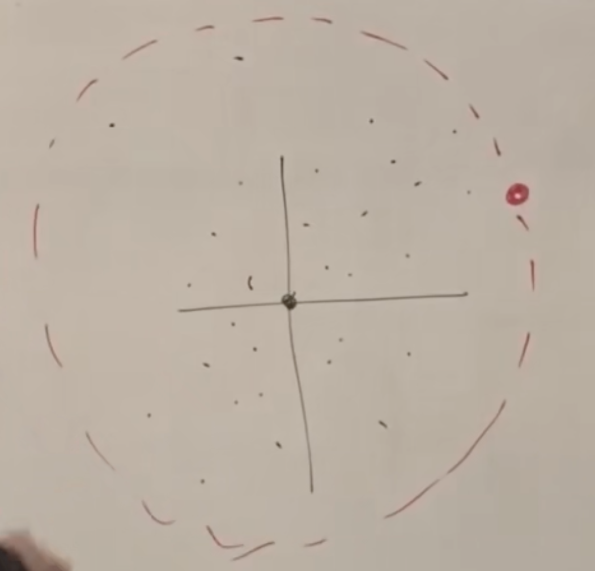

宇宙学原理：
宇宙在观测上是各向同性的，即任意方向上平均粒子数（除去银河系导致的差异）都大致相同，这就是说宇宙对地球上的观察者建立的极坐标系来说是旋转对称的，因此要么地球是宇宙的中心，要么宇宙本身是同质的（十亿光年尺度）。

星系总体来说是电中性的，大尺度上只有引力有明显效应。

由于宇宙是同质的，直觉的结论会认为宇宙是静态的（因为各方向的粒子数相同，故各个方向的引力应当互相抵消).实际上并非如此.

建立坐标，使得特定的一批星系总是在坐标的整数节点上。即星系互相远离时坐标本身也扩张，使得星系的坐标固定。这是由观测得到的。

在我们的坐标里，设定 $D_{ab} = a(t) \Delta X_{ab}$ , 其中 $\Delta X_{ab}$ 是在我们坐标中ab的距离. 有

$$ V_{ab} = \dot{a} \Delta X_{ab} $$

$$ \frac{V_{ab}}{D_{ab}} = \frac{\dot{a}(t)}{a(t)} = H(t) $$

考虑一个区间中的质量 

$$ M = \nu \Delta{x}\Delta{y}\Delta{z} $$

区间中的体积

$$ V = a^{3}\Delta{x}\Delta{y}\Delta{z} $$

因此我们的坐标系中的质量密度就是

$$ \rho = \frac{\nu}{a^3} $$

注意到由于我们对坐标的选择, 每个坐标格子中的粒子数量保持不变(即使粒子实际上是互相远离的, 我们的坐标也同时互相远离, 以保证粒子的坐标固定), 因此单位区间中的质量是固定的, 就是该区间中的粒子的总质量. 由于a是随时间变化的, 可见上式中的$\rho$也是时变的. 

考虑下面的图像, 其中原点即地球(或任意点, 由于宇宙的同质性), 为计算红点粒子的加速度, 由于宇宙的同质性(此处只需各向同性), 红点粒子只受到红色球内部质量造成的引力, 其大小等同于红球内部所有质量集中在球心造成的引力.

于是

$$

    \begin{align*}

        D &= a(t)\sqrt{x^2+y^2+z^2} = aR  \\
        V &= \dot{a}R  \\
        A &= \ddot{a}R = - \frac { \frac{4}{3} G \pi \rho (aR)^{3}}{(aR)^{2}}  \\ 
    =>  \frac{\ddot{a}}{a} &= -\frac{4}{3}\pi G \rho
    \end{align*}

$$

注意到R在最后的式子中被消掉, 因此任意远的星系其加速度都为上式中给出.

由上面的式子, 只有在空宇宙中($\rho=0$)才可能有静态宇宙($\ddot{a} = 0$)
